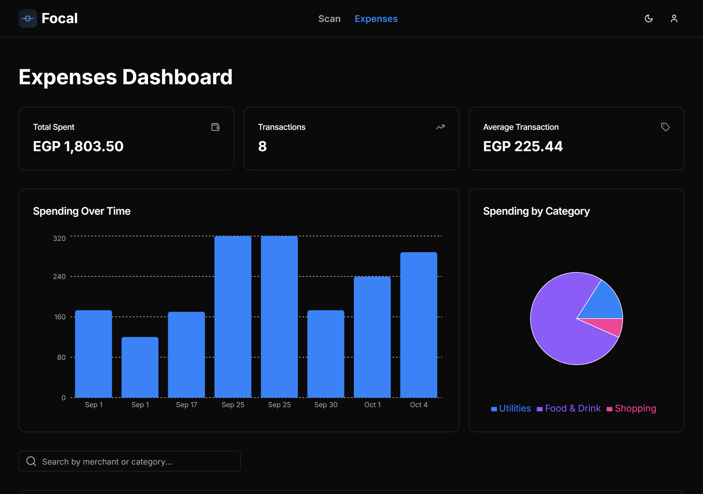
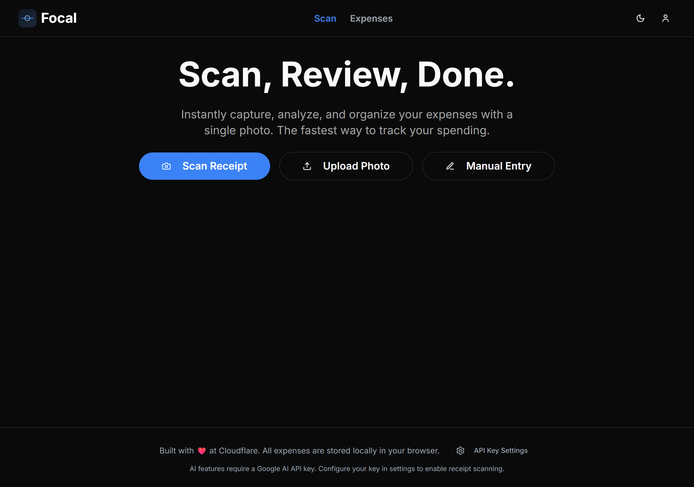
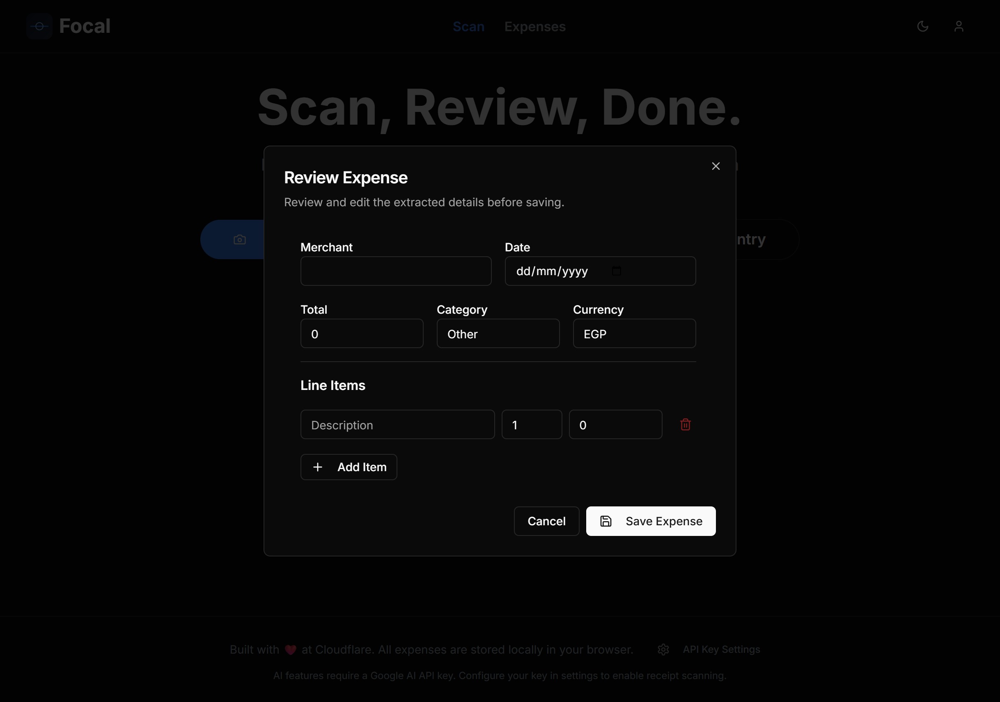

<div align="center">
  
  
  # Focal Finance Tracker

A modern, privacy-focused expense tracking Progressive Web App (PWA) with AI-powered receipt scanning. Built with React, TypeScript, and Cloudflare's edge infrastructure.



</div>

## Features

- 📸 **AI Receipt Scanning** - Extract expense details from receipt photos using Google Gemini 2.5 Flash
- 💰 **Expense Management** - Track expenses with categories, amounts, and notes
- 🔐 **Secure Authentication** - JWT-based auth with bcrypt password hashing
- 🌓 **Dark/Light Theme** - Elegant UI with theme persistence
- 📱 **Progressive Web App** - Install on mobile/desktop, works offline
- 🔒 **End-to-End Security** - Encrypted API keys, secure token storage
- ⚡ **Edge-First Architecture** - Deployed on Cloudflare's global network

## Tech Stack

### Frontend

- **React 18** - Modern UI library with hooks
- **TypeScript** - Type-safe development
- **Vite** - Lightning-fast build tool
- **TailwindCSS** - Utility-first styling
- **shadcn/ui** - Beautiful, accessible component library
- **React Router 6** - Client-side routing
- **React Query** - Server state management
- **Zustand** - Lightweight state management
- **React Hook Form + Zod** - Form handling and validation

### Backend

- **Cloudflare Workers** - Serverless edge runtime
- **Hono.js** - Lightweight web framework
- **Cloudflare D1** - SQLite database at the edge
- **Google Gemini API** - AI-powered receipt OCR

### Development

- **ESLint** - Code linting
- **TypeScript 5.8** - Type checking
- **Wrangler** - Cloudflare CLI
- **pnpm** - Fast, disk space efficient package manager

## Prerequisites

- **Node.js** 18+ (recommend LTS)
- **pnpm** 8+ (`npm install -g pnpm`)
- **Wrangler CLI** (`pnpm add -g wrangler`)
- **Cloudflare account** (free tier available)
- **Google AI Studio account** (for Gemini API key)

## Getting Started

### 1. Clone Repository

```bash
git clone <repository-url>
cd focal
pnpm install
```

### 2. Configure Environment

Create `.dev.vars` in the project root:

```bash
JWT_SECRET="your-super-secret-jwt-key-min-32-chars"
ENCRYPTION_KEY="your-encryption-key-min-32-chars"
NODE_ENV="development"
```

Generate secure secrets:

```bash
# Generate JWT secret
openssl rand -base64 32

# Generate encryption key
openssl rand -base64 32
```

### 3. Set Up Database

```bash
# Initialize local D1 database with schema
pnpm db:migrate

# Apply quantity column migration
pnpm db:migrate:002
```

### 4. Run Development Server

```bash
# Option 1: Run both frontend and backend
pnpm dev:full

# Option 2: Run separately
# Terminal 1
pnpm dev

# Terminal 2
pnpm dev:worker
```

- **Frontend**: http://localhost:3000
- **Backend API**: http://localhost:8787

### 5. Create Your First Account

1. Navigate to http://localhost:3000/login
2. Click "Register" and create an account
3. Add your Google Gemini API key in Settings
4. Start tracking expenses!

## Screenshots

<div align="center">
  
### Dashboard

*Track your expenses with beautiful visualizations and insights*

### Home Page


_Quick overview of your recent expenses and categories_

### Add Expense


_Easily add expenses manually or scan receipts with AI_

</div>

## Project Structure

```
focal/
├── src/                      # Frontend source code
│   ├── components/           # React components
│   │   ├── ui/              # shadcn/ui components
│   │   ├── AuthForm.tsx     # Login/register form
│   │   ├── ExpenseForm.tsx  # Expense entry form
│   │   ├── Layout.tsx       # App layout wrapper
│   │   └── ...
│   ├── contexts/            # React contexts
│   │   └── AuthContext.tsx  # Authentication state
│   ├── hooks/               # Custom React hooks
│   ├── lib/                 # Utilities and services
│   │   ├── expense-service.ts # Expense API client
│   │   ├── errorReporter.ts   # Error handling
│   │   └── utils.ts           # Helper functions
│   ├── pages/               # Route pages
│   │   ├── HomePage.tsx     # Dashboard
│   │   ├── ExpensesPage.tsx # Expense list
│   │   └── LoginPage.tsx    # Auth page
│   ├── App.tsx              # Root component
│   ├── main.tsx             # App entry point
│   └── sw.ts                # Service worker
├── worker/                  # Backend (Cloudflare Workers)
│   ├── handlers/            # API route handlers
│   │   ├── auth.handler.ts  # Login/register
│   │   ├── expenses.handler.ts # CRUD operations
│   │   ├── receipts.handler.ts # AI scanning
│   │   └── apiKeys.handler.ts  # Key management
│   ├── middleware/          # Middleware functions
│   │   ├── auth.ts          # JWT verification
│   │   └── cors.ts          # CORS headers
│   ├── services/            # Business logic
│   │   ├── auth.service.ts  # Authentication
│   │   ├── db.service.ts    # Database queries
│   │   ├── encryption.service.ts # API key encryption
│   │   └── gemini.service.ts     # AI integration
│   ├── index.ts             # Worker entry point
│   └── router.ts            # API routes
├── migrations/              # Database migrations
│   ├── 001_initial_schema.sql
│   └── 002_quantity_real.sql
├── public/                  # Static assets
├── functions/               # Cloudflare Pages Functions (if used)
├── scripts/                 # Build/deployment scripts
├── .gitignore              # Git ignore rules
├── DEPLOYMENT.md           # Deployment guide
├── package.json            # Dependencies and scripts
├── vite.config.ts          # Vite configuration
├── wrangler.toml           # Cloudflare Workers config
└── tailwind.config.js      # TailwindCSS config
```

## Available Scripts

```bash
# Development
pnpm dev              # Start frontend dev server (port 3000)
pnpm dev:worker       # Start backend dev server (port 8787)
pnpm dev:full         # Run both concurrently

# Building
pnpm build            # Build frontend for production
pnpm preview          # Preview production build locally

# Database
pnpm db:migrate       # Run migrations (local)
pnpm db:migrate:prod  # Run migrations (production)

# Deployment
pnpm deploy           # Deploy to Cloudflare (Workers + frontend)
pnpm setup:prod       # Run production setup script

# Code Quality
pnpm lint             # Run ESLint
```

## Database Schema

### Users Table

```sql
- id (TEXT PRIMARY KEY)
- email (TEXT UNIQUE)
- password (TEXT) -- bcrypt hashed
- created_at (TIMESTAMP)
```

### Expenses Table

```sql
- id (TEXT PRIMARY KEY)
- user_id (TEXT)
- amount (REAL)
- currency (TEXT)
- quantity (REAL)
- category (TEXT)
- description (TEXT)
- date (TEXT)
- created_at (TIMESTAMP)
```

### API Keys Table

```sql
- id (TEXT PRIMARY KEY)
- user_id (TEXT)
- service (TEXT) -- e.g., 'gemini'
- encrypted_key (TEXT)
- created_at (TIMESTAMP)
```

## API Endpoints

### Authentication

- `POST /api/auth/register` - Create new account
- `POST /api/auth/login` - Login with credentials

### Expenses

- `GET /api/expenses` - List user's expenses
- `POST /api/expenses` - Create new expense
- `PUT /api/expenses/:id` - Update expense
- `DELETE /api/expenses/:id` - Delete expense

### Receipt Scanning

- `POST /api/receipts/scan` - Scan receipt image with AI

### API Keys

- `GET /api/api-keys/:service` - Check if key exists
- `POST /api/api-keys` - Store encrypted API key
- `PUT /api/api-keys/:service` - Update API key
- `DELETE /api/api-keys/:service` - Remove API key

## Environment Variables

### Development (`.dev.vars`)

```bash
JWT_SECRET="your-jwt-secret-32-chars-minimum"
ENCRYPTION_KEY="your-encryption-key-32-chars-minimum"
NODE_ENV="development"
```

### Production (Cloudflare Secrets)

```bash
# Set via Wrangler CLI
wrangler secret put JWT_SECRET
wrangler secret put ENCRYPTION_KEY
```

See `wrangler.toml` for additional configuration.

## Deployment

Deploy to Cloudflare Pages + Workers. See [DEPLOYMENT.md](DEPLOYMENT.md) for detailed instructions.

Quick deploy:

```bash
# Set production secrets (one-time)
wrangler secret put JWT_SECRET
wrangler secret put ENCRYPTION_KEY

# Run migrations
pnpm db:migrate:prod
pnpm db:migrate:002:prod

# Deploy
pnpm deploy
```

Your app will be available at:

- **Default**: `https://<your-project>.pages.dev`
- **Custom domain**: `https://app.yourdomain.com` (after DNS setup)

## Security Features

- 🔐 **Password Hashing** - bcrypt with salt rounds
- 🎫 **JWT Authentication** - Secure token-based auth
- 🔒 **API Key Encryption** - AES-256-GCM encryption for stored keys
- 🛡️ **SQL Injection Protection** - Prepared statements via D1
- 🌐 **CORS Protection** - Configurable allowed origins
- 🔑 **Secure Headers** - Security headers on all responses
- 📝 **Input Validation** - Zod schemas for request validation

## Browser Support

- Chrome/Edge 90+
- Firefox 88+
- Safari 14+
- Opera 76+

PWA features require HTTPS (included with Cloudflare).

## Development Tips

### Hot Module Replacement (HMR)

Vite provides instant HMR during development. Changes reflect immediately without full reload.

### Type Safety

Run TypeScript type checking:

```bash
npx tsc --noEmit
```

### Database Inspection

```bash
# Local database
wrangler d1 execute focal_expensi_db --local --command="SELECT * FROM expenses"

# Production database
wrangler d1 execute focal_expensi_db --remote --command="SELECT * FROM users"
```

### Viewing Logs

```bash
# Stream production logs
wrangler tail

# Stream with filters
wrangler tail --status error
```

## Troubleshooting

### Port Already in Use

```bash
# Frontend port 3000 in use
pnpm dev -- --port 3001

# Backend port 8787 in use
pnpm dev:worker --port 8788
```

### Database Issues

```bash
# Reset local database
rm -rf .wrangler/state
pnpm db:migrate
pnpm db:migrate:002
```

### Build Errors

```bash
# Clear cache and rebuild
rm -rf node_modules dist .wrangler
pnpm install
pnpm build
```

### API Key Not Working

- Ensure key is valid in Google AI Studio
- Check encryption key is set correctly
- Verify key is stored (check Settings dialog)

## Contributing

1. Fork the repository
2. Create a feature branch (`git checkout -b feature/amazing-feature`)
3. Commit changes (`git commit -m 'Add amazing feature'`)
4. Push to branch (`git push origin feature/amazing-feature`)
5. Open a Pull Request

## License

This project is private and proprietary.

## Support

For deployment issues, see [DEPLOYMENT.md](DEPLOYMENT.md).

## Acknowledgments

- [shadcn/ui](https://ui.shadcn.com/) - Beautiful component library
- [Cloudflare](https://cloudflare.com/) - Edge infrastructure
- [Google Gemini](https://ai.google.dev/) - AI receipt scanning
- [Hono](https://hono.dev/) - Web framework

---

Built with ❤️ using React, TypeScript, and Cloudflare Workers
