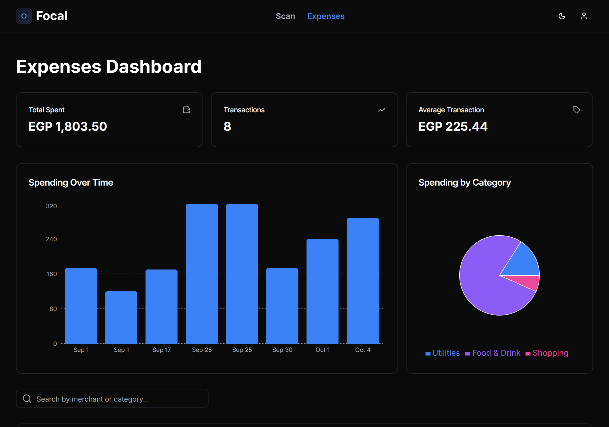
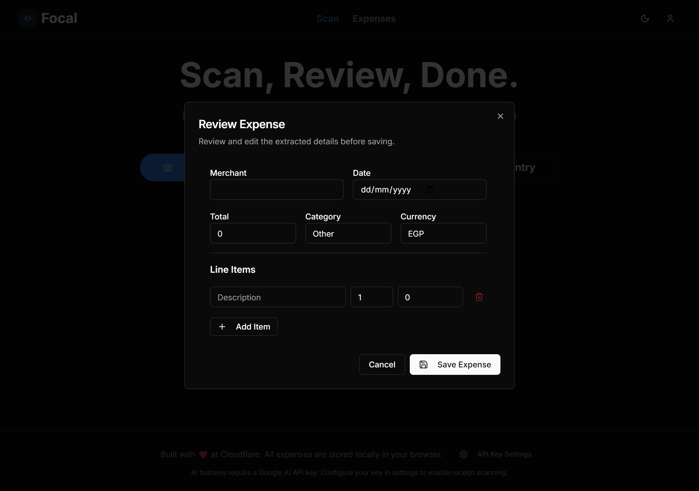
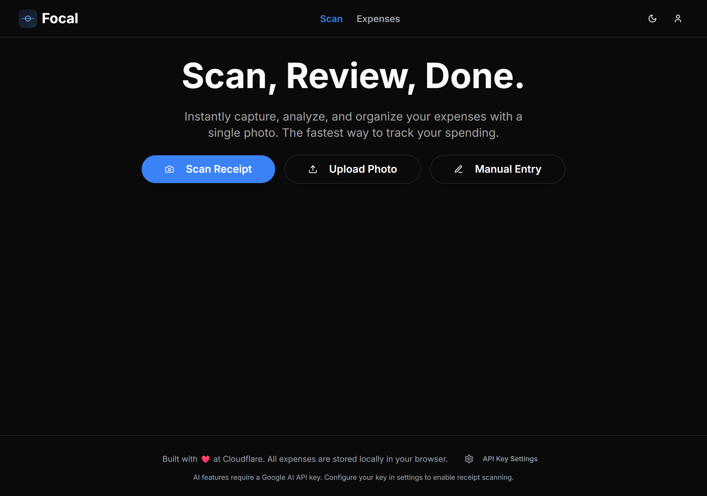

<div align="center">
  
  
  # Focal Finance Tracker

A modern, privacy-focused expense tracking Progressive Web App (PWA) with AI-powered receipt scanning.



[](https://focal.creativegeek.net)
[]()

</div>

## ✨ Features

- 📸 **AI Receipt Scanning** - Extract expense details from photos using multiple AI providers.
- 🔄 **Multi-Provider Support** - Supports Google Gemini, OpenAI GPT-4o, Nvidia NIM, and Groq (OCR+LLM).
- 🧠 **User-Selectable AI** - Users can choose their preferred AI provider.
- 📊 **Rate Limiting** - Daily quota for AI scans to manage costs.
- 💰 **Expense Tracking** - Manage expenses with categories, amounts, and notes.
- 🔐 **Secure Auth** - JWT-based authentication with bcrypt password hashing.
- 🌓 **Dark/Light Theme** - Beautiful UI with theme persistence.
- 📱 **Progressive Web App** - Install on any device, works offline.
- 🔒 **Production-Ready** - Server-side API keys, no user setup required.
- ⚡ **Edge-First** - Deployed on Cloudflare's global network.

<figure>
  
  <figcaption><strong>AI Receipt Scanning</strong>: add an expense from a photo; fields are auto-filled.</figcaption>
</figure>

## 🚀 Quick Start

```bash
# Clone repository
git clone https://github.com/Creative-Geek/Focal.git
cd Focal

# Install dependencies
pnpm install

# Set up environment (see docs/DEVELOPMENT.md)
# Create .dev.vars with JWT_SECRET and ENCRYPTION_KEY

# Initialize database
pnpm db:migrate && pnpm db:migrate:002 && pnpm db:migrate:003 && pnpm db:migrate:004 && pnpm db:migrate:005 && pnpm db:migrate:006

# Run development server
pnpm dev:full
```

Visit [http://localhost:3000](http://localhost:3000) to get started!

<figure>
  
  <figcaption>First run: Home page shown after starting the dev server.</figcaption>
</figure>

## 🛠️ Tech Stack

**Frontend:** React 18 • TypeScript • Vite • TailwindCSS • shadcn/ui

**Backend:** Cloudflare Workers • Hono.js • D1 (SQLite)

**AI Providers:** Google Gemini • OpenAI • Nvidia NIM • Groq + Azure Vision

**Tools:** ESLint • Wrangler • pnpm

## 📚 Documentation

- **[Development Guide](docs/DEVELOPMENT.md)** - Setup, configuration, and local development
- **[Deployment Guide](docs/DEPLOYMENT.md)** - Production deployment to Cloudflare
- **[API Reference](docs/API.md)** - Complete API documentation
- **[Contributing](docs/CONTRIBUTING.md)** - Guidelines for contributors
- **[Email Verification Setup](docs/EMAIL_VERIFICATION_SETUP.md)** - Email verification configuration
- **[Production Checklist](docs/PRODUCTION_CHECKLIST.md)** - Pre-deployment checklist

## 🔒 Security

- Password hashing with bcrypt
- JWT token authentication
- AES-256-GCM API key encryption
- SQL injection protection
- CORS configuration
- Input validation with Zod

## 🌐 Browser Support

Chrome/Edge 90+ • Firefox 88+ • Safari 14+ • Opera 76+

## 📝 License

[](https://opensource.org/licenses/MIT)

## 🙏 Acknowledgments

Built with [React](https://react.dev), [Cloudflare](https://cloudflare.com), [shadcn/ui](https://ui.shadcn.com), [Google Gemini](https://ai.google.dev), and [Hono](https://hono.dev)

---

<div align="center">

**[Live Demo](https://focal.creativegeek.net)** • **[Documentation](docs/DEVELOPMENT.md)** • **[Report Bug](https://github.com/Creative-Geek/Focal/issues)**

Made with ❤️ by Creative Geek

</div>
